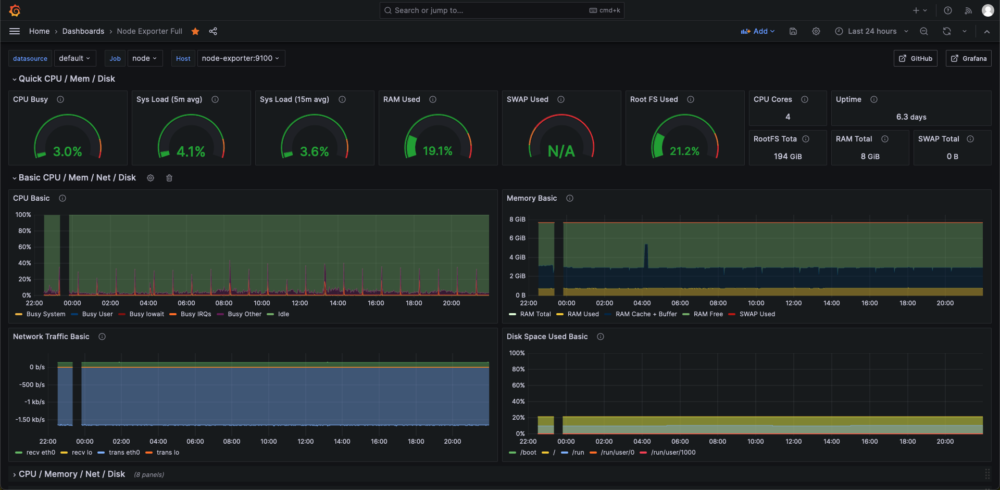
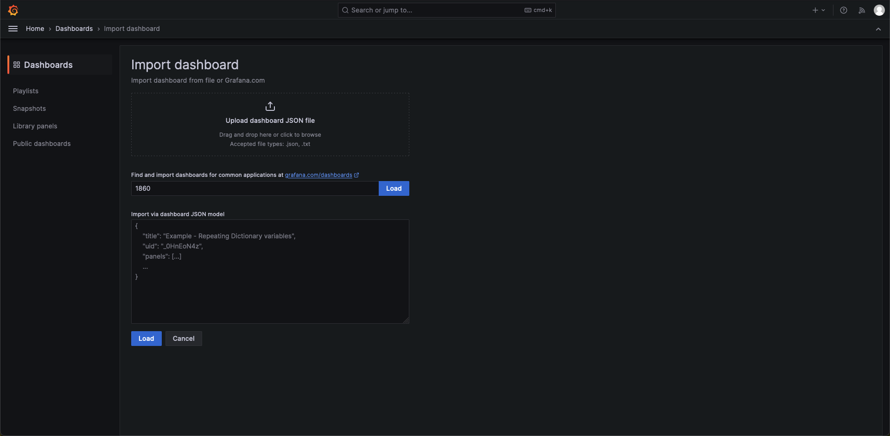

# Grafana Prometheus Node-exporter


Node Exporter captures system-level metrics from various sources, ensuring comprehensive data collection. Prometheus, the robust monitoring solution, efficiently stores and manages these metrics, offering powerful querying capabilities.



Grafana provides an intuitive and customizable dashboarding interface, allowing users to visualize data in real-time. With secure user authentication and an easy-to-use interface, managing the monitoring setup is smooth and hassle-free.
### Docker start containers
```sh
# Start containers
docker compose up -d
```
### Import Node exporter Dashboard
